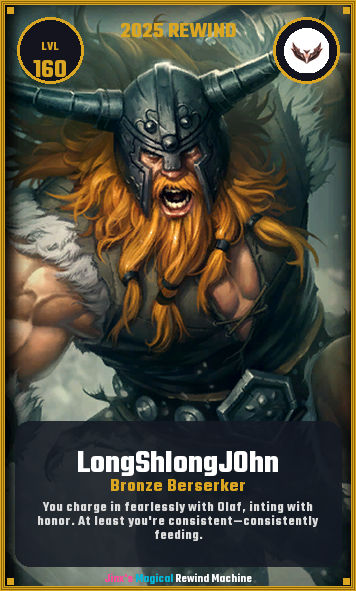

# Player Cards

**Shareable, Personalized Achievement Cards**

## Overview

Player Cards are beautiful, customized graphics that showcase your unique identity as a League of Legends player. They're designed to be shared with friends and community, turning your stats into a visual celebration of your playstyle. (the description is dependent of Coach/Roast mode)

  

## Card Components

Each player card includes:

### 1. Background Champion Art

Your most-played champion is featured as the card background, making it instantly recognizable and personal to your playstyle.

### 2. Summoner Information

- **Summoner Name** - Your in-game identity
- **Custom Title** - Based on your champ and you
- **Level** - Current account level
- **Rank** - Current competitive ranking

### 3. Custom Player Title

Based on your gameplay patterns, you receive a unique title that categorizes your playstyle. Examples might include:

- "The Aggressive Playmaker"
- "Calculated Strategist"
- "Objective Focused Leader"
- "Mechanical Prodigy"
- "Team Fight Specialist"

These titles are AI-generated based on your actual performance patterns.

### 4. Playstyle Description

A brief, personalized description that captures how you approach the game:

- Do you play aggressively or defensively?
- Are you a roamer or a farmer?
- Do you prioritize objectives or kills?
- What makes your gameplay unique?

## Sharing Your Card

Cards are designed to be:
- **Screenshot-friendly** - Perfect dimensions for Discord, Twitter, and other social platforms
- **Visually striking** - Professional design that looks impressive
- **Conversation starters** - Show your friends and compare playstyles
